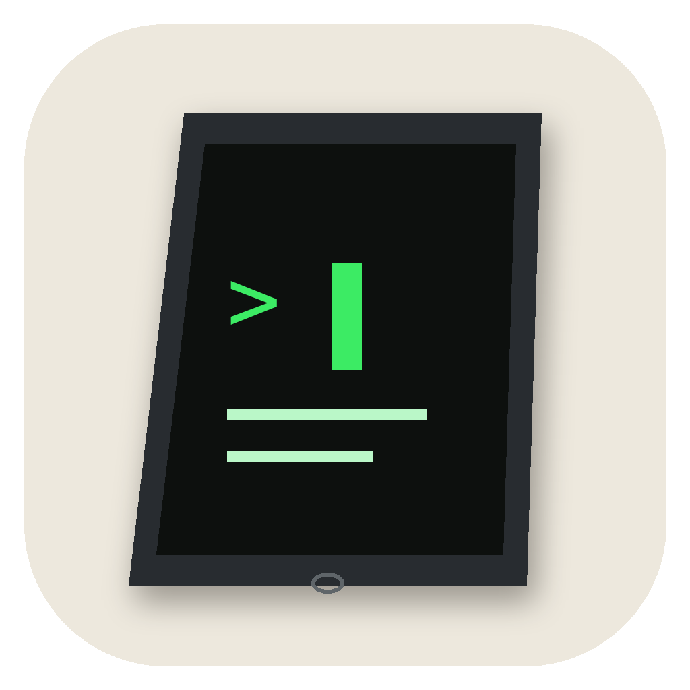

# Advisor

## 🇺🇸 [Read this README in English →](README.en.md)



*High Sierra Mac 向けの軽量AIエージェント*

引き出しで眠っている古いIntel Mac(Snow Leopard 〜 High Sierra世代)を、
実用的なAIエージェントとして蘇らせるための、軽量なターミナル＆GUIアプリです。
Claude(Anthropic)とGemini(Google)、両方のAPIに対応しています。

コマンド名は `advisor`。どちらのAIが答えているか意識せずに使えるよう、あえて
中立な名前にしています。

## なぜ作ったか

きっかけは、ほとんど使わなくなった古いMacBookでした。最初は「今どきのコーディング
エージェントは、古いVSCode(High Sierraだと1.85までしか入りません)では動かないだろう」
と思い込んでいたのですが、これは単純な勘違いでした。動くものもあります。

ただ、仮に動いたとしても、AIのAPIは決して安くありません。せっかく古いMacを
活かすなら、課金を気にせず気軽に使えるものにしたいと思いました。

そもそもの目的も2つありました。ひとつは、ただの雑談相手というか、交換日記のような、
気軽に話しかけられる存在が欲しかったこと。もうひとつは、せっかくAIを使うなら、
ターミナルからサクッとコーディングの相談やファイル操作もできるようにしたかったこと。
**「優しい相談相手」の顔と「賢く無機質なAI」の顔、その両方を1つのアプリで見せたい**、
というのがAdvisorの出発点です。GUIに「ノート」「コーディング」「ハッカー」という
3つのテーマがあるのは、この2つの顔を行き来できるようにするためです。

## こんな人に

- 引き出しに眠っている2010年代のMacを、もう一度使ってみたい人
- 罫線入りノートのような画面で、少し人間味のあるAIとの雑談・日記代わりの相手が欲しい人
- ターミナルでサクッとコードの相談やファイル操作をしたい人
- 高い月額サブスクや従量課金を避け、無料枠(Gemini)だけでまず始めてみたい人
- 家族と1台のMacを共有していても、自分の会話だけはプライベートに保ちたい人
- 日本語だけでなく英語ユーザーにも配りたい人(OSの言語設定に自動追従)

## 特徴

- **軽量・外部依存ほぼゼロ** — エージェント本体(`agent/claude-agent.pl`)はCPAN
  モジュール依存ゼロの単一ファイルPerlスクリプト。GUIはPython標準同梱のtkinterのみ。
- **2つのAIをいつでも切り替え** — Claude(Anthropic)とGemini(Google)。
  Geminiは無料枠があるので、課金ゼロで試せます。
- **GUI: ノート/コーディング/ハッカーの3テーマ** — 罫線入りノート風の会話画面、
  黒地に緑文字のハッカー風など、気分に合わせて切り替えられます。
- **ターミナルからも直接使える** — `advisor` コマンド一発。GUIを使わない人にも。
- **会話履歴は暗号化してローカル保存** — パスフレーズを知らない人には読めません。
- **日本語/英語 自動切替** — Macのシステム言語設定を見て、GUI・ターミナルの
  文言・OS標準メニューバーまで、すべて自動で切り替わります。
- **ダブルクリックで起動できる`Advisor.app`** — ターミナルに不慣れな人でも
  アイコンから始められます。Dockに置けば次回から一発です。
- **APIキーの登録もGUI上で完結** — 初めて起動したときにキーが未登録なら、
  ターミナルではなくアプリの中で案内画面が出ます。プロバイダを選んで
  ボタンからキー取得ページを開き、貼り付けるだけ。ターミナルは一度も
  開かずに使い始められます。

## 対応OSの階層

- **Tier B: Mavericks(10.9)〜High Sierra(10.13)以降** — 標準のcurlが既にTLS1.2に
  対応しているため、追加のビルドなしでそのまま動きます。今のところ実装済みなのはこちら。
- **Tier A: Snow Leopard〜Mountain Lion(10.6-10.8)** — 標準curlがTLS1.0にも届かない
  ため、モダンな機器でソース取得→対象機へ転送→対象機でローカルビルド、という手順で
  OpenSSL/curlを用意する必要があります。未着手(次のステップ)。

## セットアップ (Tier B: High Sierra など)

やり方は2通りあります。ターミナルに慣れていない人は①、開発者やターミナル操作に
抵抗がない人は②がおすすめです。

### ① ダウンロードしてすぐ使う(ターミナル不要)

1. [Releasesページ](https://github.com/watermark-hd/advisor/releases/latest)から
   **`Advisor-v0.1-standalone.zip`** をダウンロードして解凍する
2. 中の`Advisor`を`アプリケーション`フォルダ(またはDock)に置く
3. **最初の1回だけ**、ダブルクリックではなく右クリック(または control
   キーを押しながらクリック)して「開く」を選ぶ。「開発元が未確認のため…」
   という警告が出るので、もう一度「開く」を押す(有料のApple Developer ID
   署名をまだ行っていないため出る、想定内の警告です)。2回目以降は普通に
   ダブルクリックで起動できます

初回起動時にAPIキー登録の案内画面が出るので、そこで完結します。ターミナルは
一度も開きません。zipの中の「お読みください.txt」にも同じ案内があります。

### ② ソースから使う(ターミナル・開発者向け)

このリポジトリを丸ごとダウンロード(または`git clone`)して:

```bash
bash setup.sh
```

使うAI(Gemini / Anthropic)の選択、APIキーの案内・保存、`advisor` コマンドの設置、
bash補完の設置、ダブルクリック用`Advisor.app`の生成、疎通確認までを自動で行います。
完了したら新しいターミナルを開くか `source ~/.bash_profile` してから `advisor` と
打つだけです。こちらでビルドした`Advisor.app`も、①と同じ理由でAPIキー未登録なら
GUI上の案内画面から登録できます。

> `Advisor.app`は[py2app](https://py2app.readthedocs.io/)でビルドします。初回のみ
> Xcode Command Line Tools(署名用、約190MB)とpy2app本体、メニューバーの日本語化に
> 使う[pyobjc](https://pyobjc.readthedocs.io/)(約7MB)を自動で導入します。万一
> ビルドに失敗しても、シンプル版のアプリ生成に自動でフォールバックするので
> `advisor`コマンド自体は必ず使えます。

## 使い方 (GUI)

`Advisor.app`をダブルクリックするか、`advisor gui`でGUIが起動します(ターミナルは
開きません)。

**初回起動でAPIキーが未登録の場合**は、通常のチャット画面の代わりに案内画面が
出ます。Gemini(無料)かAnthropic(有料)を選び、ボタンでキー取得ページを開いて
貼り付ければ、その場で疎通確認まで行って通常画面に進みます。

- 上部の**[ 会話 ] [ コマンド ]**タブで、AIとのチャット画面とシェルコマンド実行
  パネルを切り替えられます。
- 見た目は**ノート**(罫線入りの手書き風)・**コーディング**・**ハッカー**(黒地に
  緑文字)の3テーマ。ヘッダーの**[ 見た目 ]**からいつでも切り替え可能です。
- **[ AIを切替 ]**でClaude/Geminiのモデルを選択、**[ 続きから ]**で暗号化された
  過去の会話を再開できます。
- 書き込み欄はOSの日本語入力がそのまま使えます(Terminal.appの2バイト文字問題を回避)。

## 使い方 (ターミナル / `advisor` コマンド)

エージェント本体(`agent/claude-agent.pl`)は対話ループのみのシンプルな作りのままにし、
オプション処理やモデル選択メニューは`~/bin/advisor`(bashラッパー、setup.shが生成)
側に持たせています。

**基本はこれだけ:**

```
advisor            起動する
（一覧が出るので）番号を入力    使うAIを切り替える
質問を打つ                     答えが返る
exit                           終わる
```

初回は`setup.sh`でAIを選びます。以降の切り替えは、**起動後に一覧の番号を入力する
だけ**です:

```
  1) Claude Opus 5 — 最高性能・有料
  2) Claude Sonnet 5 — バランス型・有料
  3) Claude Haiku 4.5 — 高速・有料
  4) Gemini Flash-Lite — 速い・無料   ← 使用中
  5) Gemini Flash — 高性能・無料
番号を入力すると切り替わります。そのまま質問してもOK。

ご用件をどうぞ> 3        ← これだけで Haiku に切り替わる
```

会話中に使えるもの:

| 打つもの | 何が起きる |
|---|---|
| `1`〜`5`(番号) | そのAIに切り替え(プロバイダも自動・次回に引き継ぐ) |
| `/model` または `?` | AIの一覧をもう一度表示 |
| `/claude` / `/gemini` | プロバイダだけ切り替え |
| `exit` / Ctrl-D | 終了 |

シェルから使うオプション(必要なときだけ):

```
advisor --select-model [番号] 使うAIをシェルから決める
advisor --list-models         使えるAIの一覧
advisor -m <ID>               今回だけ別のAIで起動
advisor --list-history        保存済みの会話を一覧表示
advisor --resume              保存済みの会話を続きから
advisor --no-history          今回は保存しない
advisor --change-passphrase   履歴パスフレーズを変更
advisor --set-recovery        合言葉を設定
advisor -h / --version        ヘルプ / バージョン
```

新しいターミナルでは`advisor `と打ってTabキーを押すとオプション名が、
`advisor -m `の後でTabを押すと選択可能なモデルIDが補完されます
(`completion/advisor-completion.bash`、High Sierra標準のbash 3.2で動作確認)。

- 一覧をもう一度見たいときは**`/model`**(または`?`)。
- 番号で選ぶと、そのAIのプロバイダ(Claude/Gemini)も自動で合わせ、`~/.claude-agent-env`
  に保存されて次回起動にも引き継がれます。選んだAIのキーが未登録なら、その場で
  貼り付けて保存するか聞かれます。
- プロバイダだけ切り替えたいときは**`/claude`** / **`/gemini`**。
- Geminiは単純な質問でも思考に時間をかけがちなので、既定で思考を浅く(`LOW`)。
  深く考えさせたいときは`CLAUDE_GEMINI_THINKING=high`。

## 日本語/英語について

Macのシステム言語設定(`defaults read -g AppleLocale`)を見て、GUI・ターミナル・
`setup.sh`の案内文・OS標準のメニューバーまで、すべて自動で日本語/英語が切り替わります。
`CLAUDE_LANG=en`(または`ja`)環境変数で手動指定もできます。

## 会話履歴 (暗号化してローカル保存)

会話は既定で`~/.claude-agent/history/<日時>.json.enc`に暗号化して保存されます。
家族と1台のMacを共有していても、パスフレーズを知らない人には読めません。

### しくみ

- ランダムな**マスター鍵**で各会話ファイルを暗号化し、そのマスター鍵自体を
  **パスフレーズ**(と、任意で**合言葉**)で包んで`key.enc` / `key.recovery.enc`に
  保存します。どちらか一方でマスター鍵を取り出せるので、パスフレーズを忘れても
  合言葉で復旧できます。
- 暗号化は`openssl enc -aes-256-cbc`にシェルアウトして行います(High Sierra標準の
  LibreSSLで動作)。秘密は環境変数経由でopensslに渡し、`ps`出力やコマンドライン、
  ディスクには出しません。
- High SierraのLibreSSLは`-pbkdf2`非対応のため鍵導出はMD5ベースとやや弱めですが、
  平文でそのまま置くよりははるかに安全、という位置づけです。

### 使い方

- 初回起動時にパスフレーズを設定します(2回入力)。続けて合言葉(秘密の質問)も
  任意で設定できます。以降は起動のたびにパスフレーズを1回だけ聞かれます(非表示)。
  打ち間違えても回数制限はなく、何度でも入れ直せます。何も入力せずEnterを押せば、
  その回だけ履歴を保存せずに起動します。
- パスフレーズを忘れたら、プロンプトで`r`と入力すると合言葉での復旧に進めます
  (合言葉を設定してある場合のみ)。復旧後にパスフレーズを再設定できます。
  合言葉の答えは大文字小文字と前後・連続空白を区別しません。
- `advisor --resume`で前回の続きから、`advisor --list-history`で一覧を確認。
- `advisor --change-passphrase`でパスフレーズ変更、`advisor --set-recovery`で
  合言葉の設定/変更(いずれもマスター鍵を包み直すだけなので既存の履歴はそのまま)。
- `advisor --no-history`(または環境変数`CLAUDE_NO_HISTORY=1`)で保存を無効化。
  このときパスフレーズは尋ねられません。
- **パスフレーズも合言葉も両方忘れると、それまでの履歴は復号できなくなります。**
  作り直す場合は`~/.claude-agent/history/`を削除して再設定してください。

> 注意: 合言葉の答え(「初めて買った車の名前」など)は推測されやすいと、そこが
> 一番の弱点になります。パスワード並みに自明でないものを選ぶか、その弱さを承知で
> 使ってください。

## エージェントについて (`agent/claude-agent.pl`)

- 単一ファイル、外部CPANモジュール依存ゼロ
- JSON encode/decodeは自前実装(再帰下降パーサー)
- 4つのツール: `read_file` / `write_file` / `list_dir` / `run_shell`(書き込み・実行は
  確認プロンプトあり)
- 会話履歴は常にAnthropicのcontent blocks形式で内部保持し、Gemini利用時のみ
  API呼び出しの直前/直後に`contents`/`parts`形式へ変換。ツール実行や入力処理の
  コードはプロバイダを一切意識しない
- Gemini 3系の`thoughtSignature`(functionCallを送り返す時に付け直さないと400)にも対応
- HTTP通信はcurlをサブプロセスとして呼び出す方式(TLSをPerl側に持たせない)
- 会話履歴は`openssl`にシェルアウトして暗号化保存(上記参照)
- `CLAUDE_CURL` / `CLAUDE_CACERT`環境変数で、Tier A向けの自前ビルドtoolchainに
  差し替え可能(`setup.sh`は`~/claude-toolchain`があれば自動的にそちらを優先する)

## 課金について

このリポジトリ自体は自由に使えますが、実際にAPIを使うには各自でキーの発行が必要です。
コードにAPIキーは一切含まれていません。

- **Gemini**: [aistudio.google.com/apikey](https://aistudio.google.com/apikey)で
  Googleアカウントがあれば発行でき、無料枠(カード登録不要)だけで気軽に使い始められます。
- **Anthropic**: [console.anthropic.com](https://console.anthropic.com/)でキーを発行し、
  Billingで少額チャージ(claude.aiのPro/Max等のサブスクリプションとは別の従量課金)。

## ライセンス

[MIT License](LICENSE)
